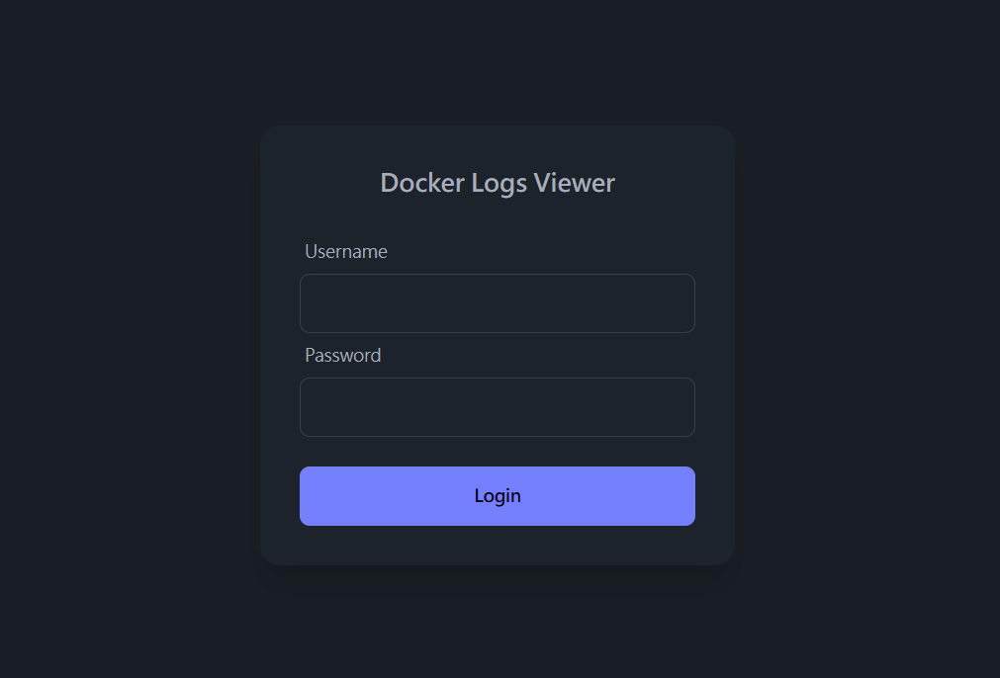

<h3 align="center">Container Watcher</h3>

A powerful web application for real-time monitoring of Docker container logs across multiple servers with collaborative management features.
 

## Table of Contents

- [Table of Contents](#table-of-contents)
- [About The Project](#about-the-project)
  - [Key Features](#key-features)
  - [Built With](#built-with)
- [Getting Started](#getting-started)
  - [Prerequisites](#prerequisites)

## About The Project

Container Watcher is a web-based monitoring solution that enables real-time observation of Docker container logs across multiple servers. With built-in user management and collaborative features, it's perfect for teams managing distributed container deployments.

### Key Features

- 🔄 Real-time monitoring of Docker container logs across multiple servers
- 🔐 Secure SSH key authentication for remote server connections
- 👥 Multi-user collaboration with role-based access control (admin/operator)
- 🏷️ Container tag management for better organization
- 📊 Interactive web interface with real-time updates
- 🔍 Advanced log filtering and search capabilities

### Built With

* [Node.js](https://nodejs.org/)
* [Express](https://expressjs.com/)
* [SQLite3](https://www.sqlite.org/)
* [EJS](https://ejs.co/)
* [SSH2](https://github.com/mscdex/ssh2)

## Getting Started

Container Watcher supports installation methods: Docker containerized deployment

### Prerequisites

* docker and docker-compose installed on your system

* Before using docker-compose, make sure to set your SESSION_SECRET variable in the docker-compose.yml file
